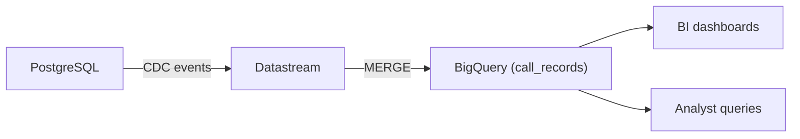
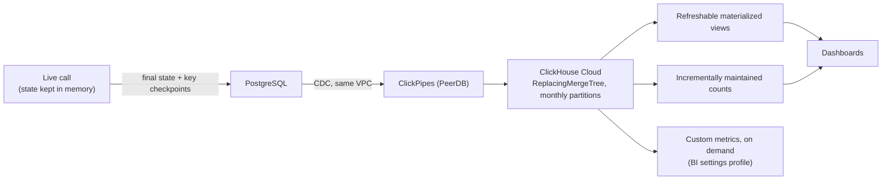

_At 15 million call minutes a day, our analytics pipeline was delivering call data 5-15 minutes after the call ended, and the BigQuery bill kept climbing. We replicated Postgres into ClickHouse Cloud with ClickPipes, moved dashboards off raw CDC tables, and changed what our application writes in the first place. Here is what broke along the way, and what the pipeline looks like now._

At Bolna, we help businesses build and deploy voice AI agents that make and answer phone calls at scale, with a strong focus on multilingual conversations. Every one of those calls generates data, and that data powers everything from our internal analytics to the dashboards our customers use to track how their agents are performing.

On the surface, a call is simple. Someone calls, it gets answered, and it either goes well or it does not. Underneath, a single call moves through a whole sequence of states: queued, ringing, in-progress, transcribing, and eventually completed. Each of those status updates lands in PostgreSQL as an updated row, and that is the traffic from one call. Bolna handles around 15 million minutes of calls a day, so it is worth imagining how much the database is changing at that volume.

That same data feeds our internal dashboards, and our customers pull 15-16 different metrics from the Bolna dashboard to track their calls. So when the data arrived late, it was noticeable, and it turned into tickets from both our own team and our customers. A call would be finished, but the analytics for it were not there yet. Once we traced those tickets back to the pipeline, it was clear what needed fixing.

So we moved from BigQuery to ClickHouse Cloud. This post covers what we broke, how the architecture changed, and how we ended up at roughly one-sixth of the cost we started with.

## TL;DR

-   At 15M call minutes a day, our Datastream to BigQuery pipeline delivered call data 5-15 minutes late, and repeated `MERGE` scans on one large table kept driving costs up.
-   We replicated Postgres into ClickHouse Cloud with ClickPipes, then moved dashboard queries off raw CDC tables and onto materialized views, and fixed missing JSONB data with `REPLICA IDENTITY FULL`.
-   We now write only the final call state to Postgres, not every status change along the way. That cut CDC volume across the whole pipeline.
-   Call data arrives in real time, customers can run custom metrics on demand, and analytics costs dropped about 6x.

## Where we started: Datastream into BigQuery

The original setup was straightforward. Datastream picked up CDC events from PostgreSQL and shipped them to BigQuery, and our analysts queried BigQuery directly to build BI dashboards on top of it.



It worked well at first, and then two problems showed up.

The first was delay. Five minutes does not sound like much on a normal day, but when a customer is waiting for their call data to update, or you are debugging a call that happened a few minutes ago and the update is taking anywhere between 5 and 15 minutes to land, it is a long time. It was a source of friction for customers and for our own team.

The second was cost. When we dug into the BigQuery bill, a lot of it came down to a single table: `call_records`. It was large and unpartitioned, so every time Datastream applied a change with a `MERGE`, it could scan the whole table even when the change itself was small. The dashboards our analysts built were querying that same table, so the scans were happening over and over. We were paying to stream the data into BigQuery, and then paying again for the compute to query and update it.

## The move to ClickPipes

BigQuery was no longer a good fit for the way we were using the data, so we moved analytics to ClickHouse Cloud and used ClickPipes, which is built on PeerDB, to get the data there. We ran it in the same VPC as the database, partly to avoid unnecessary network costs and partly because the connection was simpler to set up that way.

Getting the existing data across took about 20 hours. Once the backfill finished, ClickPipes started pulling in new changes from Postgres on its own, and our analytics team could begin moving their queries over to ClickHouse.

Updates work differently in ClickHouse than they did in BigQuery. It does not update a row in place every time something changes. It writes a new version of the row and works out which one to keep during background merges. Our replicated tables use `ReplacingMergeTree` with `_version` and `_is_deleted` columns for exactly this, partitioned by month. That one detail turned out to shape most of what went wrong next.

## Problem 1: querying raw CDC tables with FINAL

At first we queried the replicated tables directly, and that did not last very long.

Background merges do not happen right away. Until a merge finishes, a table can hold several versions of the same row, so a correct query has to pick the latest version of each one. The easiest way to do that is `FINAL`, which handles the deduplication as part of the query:

```sql
SELECT status, count()
FROM call_records FINAL
WHERE created_at >= now() - INTERVAL 7 DAY
GROUP BY status;
```

On a table as large and as frequently updated as `call_records`, this used a lot of memory. A single query on its own would have been fine. The problem was that we had many dashboards, and several of them refreshing around the same time was enough to cause memory spikes and push ClickHouse into autoscaling.

So we moved most of that work out of the dashboard queries.

For the heavier reports, there was no reason to run the same expensive query every time someone opened a dashboard. Those went into refreshable materialized views, which run on a schedule, do the deduplication once, and store the result in a much smaller table the dashboards can query directly.

For the lighter metrics we went further. Take something like total calls in a day: you do not want to recount every call since the morning each time the dashboard loads. Instead we keep a running count and add to it as new calls come in. It is quick, it is always up to date, and it never rescans old data.

We also wanted a bad query to stay a bad query instead of becoming a cluster problem, so we gave BI users their own settings profile: per-user limits on memory, on how many queries can run at once, and on how long a query may run. A query that grows too large spills to disk rather than eating all the memory. If someone runs something heavy by accident, it affects their query and not everyone else's dashboards.

## Problem 2: TOAST and missing JSONB data

The next problem was harder to spot, because nothing was obviously failing. Some of the JSONB config columns would occasionally show up in ClickHouse as null, or carrying an older value, while the same row in Postgres looked completely fine.

It came down to how Postgres handles large values. When a value is too large for the main row, which is common for big JSONB blobs and large arrays, Postgres stores it in a separate TOAST table and keeps a pointer in the row itself.

That is normally invisible, but logical replication has a catch. If an update does not touch a TOASTed column, Postgres does not necessarily send that column's full value again in the WAL event; it can mark it as unchanged instead. If that is not handled correctly downstream, the new row version can end up missing the column or carrying a stale value.

We fixed it on the Postgres side by setting the affected tables to `REPLICA IDENTITY FULL`:

```sql
ALTER TABLE bot_configs REPLICA IDENTITY FULL;
```

This makes Postgres include the complete old row in the WAL for updates and deletes, so the CDC side has the values it needs instead of having to deal with missing TOASTed columns. Once we made the change, the mismatches in ClickHouse disappeared.

We did not enable it everywhere. `FULL` means more data in the WAL, so we used it only where we needed it. To check what a table is currently using:

```sql
SELECT relname, relreplident
FROM pg_class
WHERE relname IN ('bot_configs', 'call_records');

-- d = default, f = full, i = index, n = nothing
```

## Problem 3: too many updates, too much CDC

As volume grew, so did the ClickPipes charge. A voice call is a series of updates: the status changes as the call moves through its lifecycle, and every status change, timestamp, and intermediate field is an `UPDATE` in Postgres, which means another CDC event and another row version in ClickHouse.

What we noticed is that almost none of those intermediate updates were ever queried. They mattered only while the call was live. So we changed how the application writes: during a call we keep the fast-changing state in memory, and we write the final state to the database when the call ends, along with a few key checkpoints. Fewer `UPDATE`s meant:

-   Lower ClickPipes costs, because there are fewer change events to replicate.
-   Less write load and WAL generation on Postgres.
-   Fewer row versions for ClickHouse to merge.

This was the largest cost reduction of everything we did, and it came from the application layer rather than the database. It brought our cost down to roughly one-sixth of what it had been.

## What we have now

This is the pipeline today:



Data used to arrive 5-15 minutes after the fact. Now a call's data is there within a minute or two of the call ending, and queries over it come back in seconds. That is where the move started making a real difference for customers: they can define custom metrics, add whatever filters they need, and run them across their call data without waiting around for a result. ClickHouse handles the heavier queries, and the materialized views keep the data we use most often ready to read, so results stay fast as the data grows.

## If we were doing this again

-   **CDC has a cost of its own.** On BigQuery, our `MERGE` operations scanned large tables even when the actual change was small. We were thinking about how much data was changing; what mattered just as much was how the warehouse handled those changes.
-   **Raw CDC tables are not a good place for dashboards.** `FINAL` gave us correct results, but it redid all that work every time someone loaded a dashboard, and that got expensive fast. Moving the repeated work into materialized views made a large difference.
-   **Check replica identity early.** The TOAST issue was the sneakiest problem we hit. If you are replicating tables with large JSONB values or arrays, check what is actually making it into the WAL, because it may not be everything you expect. `REPLICA IDENTITY FULL` fixed it for the tables that needed it, at the cost of a bit more WAL volume.
-   **Writing less data helps everywhere.** Some of the cheapest fixes had nothing to do with ClickHouse. Moving short-lived call state out of Postgres meant fewer writes on the database, and fewer changes for the rest of the pipeline to carry.
-   **Keep ClickPipes close to Postgres.** Running it in the same VPC meant less network overhead, a simpler connection, and lower network costs.

## Closing the gap between "call ended" and "here's what happened"

Moving to ClickHouse turned out to be more than swapping one warehouse for another. We changed how we write some of our data, how it is replicated, and how we query it once it lands. We started because the old setup was slow and expensive; what we ended up with is faster call data, lower analytics costs, and a setup that lets us do more with that data for our customers.

The problem was easy to describe: a call would finish, but the analytics our team and our customers needed were not there yet, and that gap kept arriving as tickets from both sides. With data landing in real time and queries returning quickly, the gap is mostly gone. What has changed more is what people do with the data now that it is there when they need it.

**Debugging while the customer is still on the thread.** When a customer reports that a call dropped halfway through, our on-call engineer no longer waits 10-15 minutes for the record to appear. They can pull the call's status, transcript, and agent config within a minute or two of it ending, and reply in the same conversation. The "is the data updated yet?" tickets that started this whole project have largely stopped.

**Fixing a campaign while it is still running.** Say a customer is running an outbound reminder batch across thousands of numbers. An hour in, they notice connect rates for one region are well below the rest. Before, they would have found out the next morning, after the batch had already finished. Now they can change the calling window or the agent's opening line and see whether it helped within the same batch.

**Iterating on agents in hours, not days.** Product owners on the customer side can test two versions of an agent prompt and compare call dispositions (interested, callback requested, not reachable) shortly after the calls end. That means several rounds of iteration in a day instead of one round every day or two. It matters even more for multilingual agents, where a Hindi agent and a Tamil agent built from the same flow can perform very differently.

**Letting customers ask their own questions.** Custom metrics only work because queries are fast enough to run on demand. Instead of being limited to the 15-16 metrics we had already built, customers can define what matters to their business, add their own filters, and get answers across all their call data. Internally, the same speed means our CS and sales teams can pull live usage while they are on a call with a customer, instead of promising to follow up later.

For a platform where every call is a chance for a customer to learn something about their agents, cutting the time it takes to get value from that data turned out to be the real win, even more than the 6x cost reduction.
