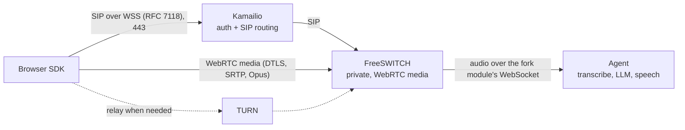
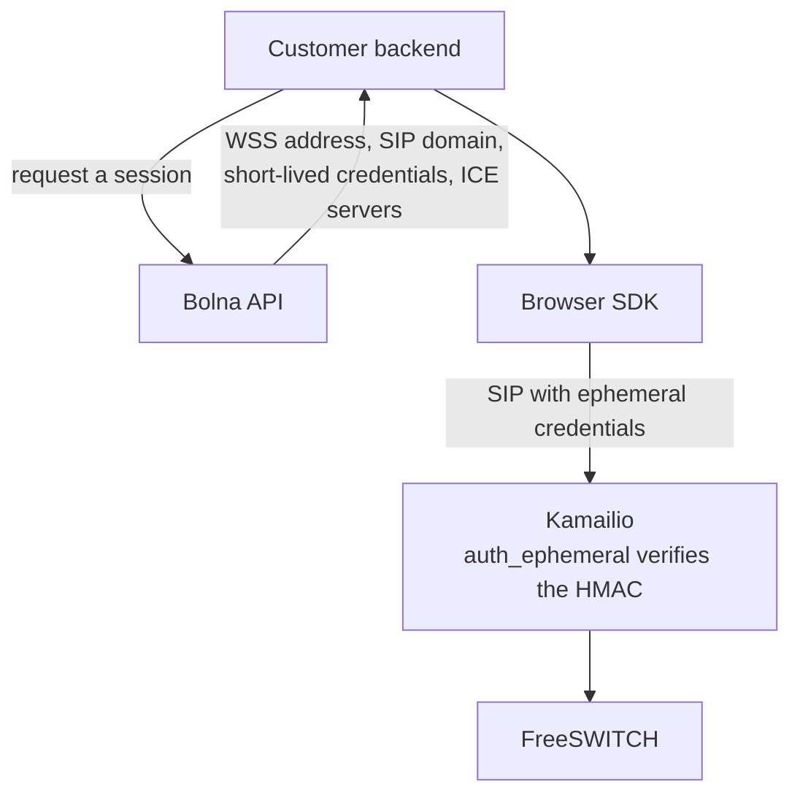

_Customers wanted to put a Bolna agent on their own website and let visitors talk to it there, without picking up a phone. We budgeted five to six weeks for it. The proof of concept took about two, and everyone had the feature in roughly three. This is what our existing telephony stack gave us for free, what we had to put in front of it, and the things that only showed up after launch._

## The ask

For a while people kept asking whether they could drop a Bolna agent onto their website and let visitors talk to it right there. Almost everything we did involved a phone number. We were built around telephony, that was just how conversations happened for us, and so the request took a bit to register as something we should actually go and do.

But it isn't a strange thing to want. If someone is already on your site and you tell them to pick up their phone to speak to the thing in front of them, that's an extra step for no reason.

Our engineers sat with two customers and went through what they wanted and how they'd use it inside their own products. Browser calling was the ask. We also needed to know what those customers would have to build on their side for it to be worth anything to them, which is a different question and the one that ended up shaping more of the work. We put five to six weeks on it. Given how much of our stack assumed a phone call somewhere in the path, that seemed fair at the time.

## Getting through the telephony stack we already had

The agent pipeline turned out to need almost nothing, which I did not expect.

It takes audio over a WebSocket, transcribes it, runs the text through an LLM, generates speech, sends it back. We wanted exactly that conversation, just arriving from a browser. Nearly everything that assumed a telephony provider was happening before audio ever reached that interface.

We tried a managed WebRTC platform first and got a call working through it. I was still hesitant. It meant a per-minute charge on every call, and another service sitting in the middle of our media that we'd have less visibility into on the day something broke. We already ran our own telephony infrastructure. I wanted to know what we could reuse before signing up for someone else's. We also talked about writing the WebRTC stack ourselves, though I don't think this blog would exist yet if we'd gone that way.

SIP over WebSocket was the thing that made it click. SIP signalling from the browser, WebRTC carrying the media. FreeSWITCH already supported DTLS, SRTP and Opus and we knew how to run it, which counts for more than it sounds like.

So the first version connected the browser straight to FreeSWITCH, and a vendored media fork module streamed audio over a separate WebSocket to the agent. The module needed a patch, mostly for pushing the agent's generated speech back into the call and for barge-in. When someone starts talking while the agent is mid-sentence, playback has to stop.

Proof of concept in about two weeks. That told us more about the remaining work than our estimate ever did.

## Making it something we could actually run

We'd thought about Kamailio for authentication and SIP routing early on and then left it out to move faster. As production got closer we wanted both of those handled before traffic reached FreeSWITCH, plus somewhere sensible to manage incoming call volume. So Kamailio went in front and parts of the setup had to be redone.

I would put it there from the start next time. We needed it anyway. Skipping it only bought us the same work twice.

Kamailio accepts the public WSS connection on 443, handles the handshake and the SIP authentication, and routes calls to FreeSWITCH. FreeSWITCH sits privately behind it on the SIP side and handles the WebRTC media.

The browser's WSS connection carries the SIP messages, which is RFC 7118. Audio goes over WebRTC to FreeSWITCH, through TURN when a relay is needed, then over the fork module's WebSocket to the agent.

Beyond that there was backend work for web call sessions, authentication and sample rates, and an SDK for the browser side. Calls run through the same FreeSWITCH dialplan, the same recording path and the same call detail record flow as phone calls, so recordings and analytics came along without us building second versions of anything. Another week or so to have it live for everyone. Capacity controls were still not good enough at that point, but at least we were improving something real instead of guessing at it.

## What the integration has to know

The customer's backend asks our API for a session. The response hands the SDK its connection details, credentials and ICE servers.

Kamailio's `auth_ephemeral` module verifies our HMAC based credentials against a shared secret, so there are no permanent SIP accounts and no database lookup for a user. Session credentials last about two minutes and are single use. Preventing reuse takes enforcement beyond just checking the HMAC and the expiry, which is worth saying plainly because it is easy to assume the expiry is doing more work than it is. TURN credentials are short-lived in a similar way.

We also return the WSS address and the SIP domain in that session response, and that paid off faster than I expected it to.

A few weeks after launch we moved the public edge to a different domain. Customer JavaScript stayed exactly as it was. We changed DNS, the certificate and two environment variables, and new sessions came back with the new address. I would have been annoyed at us if customers had to redeploy their websites for that. They'd already spent time integrating this. Our infrastructure decisions shouldn't keep landing on their plate.

## The call was answered and there was no agent

After launch, FreeSWITCH would sometimes answer a call and the audio fork would never connect. The call row just sat there marked in progress.

Nothing crashed. Nothing logged anything alarming. An answered call and a connected agent are two different things and we'd only managed the first one, which is obvious in hindsight and was not obvious at 1am.

What we did notice was the open file descriptor count on the media server climbing. Counting entries under `/proc/<pid>/fd` got us to the fork module's WebSocket client, which under a particular disconnect ordering left one descriptor open per affected call. Baseline dropped from around 466 to 31 once teardown was fixed and stayed there. We graph that number now.

We added concurrency controls in Redis too, global and per-customer, checked when the session is created. And a reaper for sessions where someone asks for credentials and then never connects, because otherwise those sit there holding capacity for a call that is never going to happen.

The origin allowlist at Kamailio was also blocking legitimate customer domains now and then. Our socket doesn't use cookies or anything else that gets attached automatically, so a caller needs the short-lived session credential regardless of where they're calling from. For this setup the allowlist was adding very little and breaking real calls, so we moved to observing origins without rejecting on them. If you're authenticating with cookies that reasoning does not transfer.

## Where it landed

Three weeks, roughly, from start to everyone having it. Customers can put the same agents on their websites now, with the same recordings and analytics, and a session API and SDK for their developers.

I'd gone in expecting the telephony stack to need a lot of changes. We kept nearly all of it. Most of the time went on the connections around the agent rather than the agent itself.
